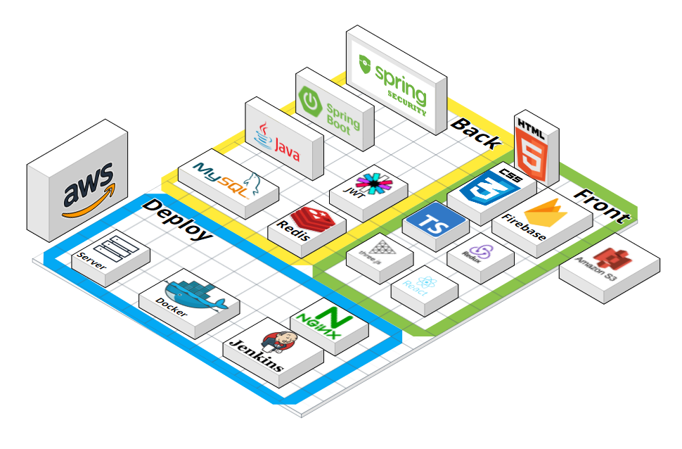
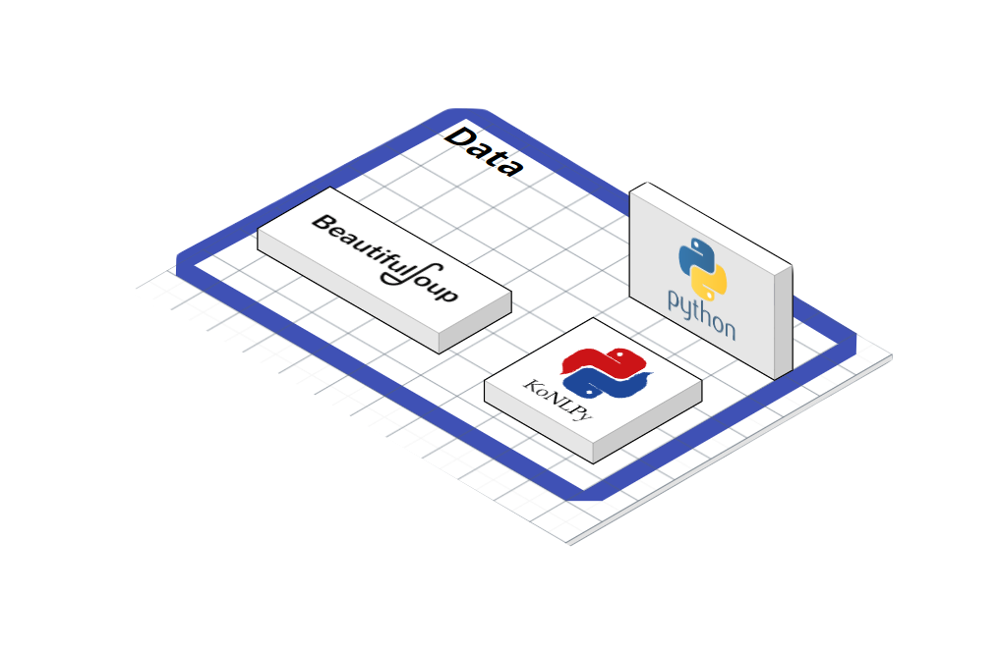

# 📚포팅 메뉴얼

## 📑목차

### [1. 기술 스택 & 버전 정보](#기술-스택-버전-정보)

### [2. 빌드 방법](#빌드-방법)

### [3. Docker & Jenkins (서버 배포)](#docker-jenkins-서버-배포)

### [4. MySQL 모니터링](#mysql-모니터링)

### [5. 기타 설정](#기타-설정)

---

## 🛠기술 스택 & 버전 정보

### 1. 이슈관리


</br>

### 2. 형상관리


</br>

### 3. 커뮤니케이션

 

</br>

### 4. 개발 환경

#### **IDE**


#### **DB**


#### **UI/UX**


#### **Server**


</br>

### 5. 상세

#### **Backend**


#### **Frontend**


#### **DATA**


#### **Monitoring**


#### **CI/CD**


---

## ⚙빌드 방법

### ◼BE

1. **`back-server`** 프로젝트 열기
2. JDK 11 버전 확인
3. src/main/BackApplication class 실행

### ◻FE

1. **`front-server`** 로 이동
2. npm install --global yarn
3. yarn install
4. yarn start

### ◼MONITORING

1. My-SQL exporter 설치
2. Prometeus로 데이터 추출
3. Grafana로 Prometeus 데이터 연결
4. [Grafana MySql Overview](https://grafana.com/grafana/dashboards/7362-mysql-overview/) 활용하여 시각화

---

## 🌞Docker & Jenkins (서버 배포)




### 1. 서버 접속

```bash
# Window Terminal 사용
## - ssafy 제공 서버 : Front, Back 서버 ( pem 키 사용 )
ssh [사용자-계정-아이디]@[탄련적IP/도메인 주소] => 비밀번호 입력 후 접속
ssh -i [키명.pem] ubuntu@[탄련적IP/도메인 주소]
```

### 2. 기본 설정

```bash
# 방화벽 설정
sudo ufw allow 22 # ssh
sudo ufw allow 80 # http
sudo ufw allow 443 # ssl
sudo ufw allow [8080/5000/9090/...] # 필요한 포트 번호 개방
sudo ufw enable
# 상태 확인
sudo ufw status
```

### 3. Docker 설치

```bash
# 사전 패키지 설치
sudo apt update
sudo apt-get install -y ca-certificates \
    curl \
    software-properties-common \
    apt-transport-https \
    gnupg \
    lsb-release

# gpg 키 다운로드 : 프로그램 패키지가 유효한지 확인하기 위해 gpg키를 통해 검증
sudo mkdir -p /etc/apt/keyrings
curl -fsSL https://download.docker.com/linux/ubuntu/gpg | sudo gpg --dearmor -o /etc/apt/keyrings/docker.gpg

echo \
    "deb [arch=$(dpkg --print-architecture) signed-by=/etc/apt/keyrings/docker.gpg] https://download.docker.com/linux/ubuntu \
    $(lsb_release -cs) stable" | sudo tee /etc/apt/sources.list.d/docker.list > /dev/null

# Docker 설치
sudo apt update
sudo apt install docker-ce docker-ce-cli containerd.io docker-compose
```

### 4. 젠킨스 설치

#### 젠킨스 설치

- 새로운 네트워크 생성

```bash
# 동일한 네트워크를 사용하기 위해 새로운 네트워크 생성
sudo docker network modoostock
```

- docker-copmpose.yml 생성 : vim 이용
  - 필요한 요소들은 같은 network로 묶어서 활용

```yml
version: "3"

services:
  jenkins:
    image: jenkins/jenkins:lts
    container_name: jenkins
    volumes:
      - /usr/bin/docker:/usr/bin/docker
      - /var/run/docker.sock:/var/run/docker.sock
      - /jenkins:/var/jenkins_home
      - /home/ubuntu/certbot:/var/certbot
    ports:
      - "9090:8080"
    privileged: true
    user: root
  redis:
    image: redis:latest
    container_name: redis
    restart: always
    command: redis-server --port 6379
    hostname: modoostock-redis
    ports:
      - 6379:6379
    networks:
      - modoostock
  mysql:
    image: mysql:8.0.33
    container_name: mysql
    restart: always
    volumes:
      - "./db/conf.d:/etc/mysql/conf.d"
      - "./db/data:/var/lib/mysql"
      - "./db/initdb.d:/docker-entrypoint-initdb.d"
      - "./data:/data"
    hostname: modoostock-mysql
    ports:
      - 3306:3306
    env_file:
      - ".env"
    networks:
      - modoostock
  # - 중략 -

# 외부에서 생성한 네트워크를 사용하기 위한 설정
networks:
  modoostock:
    external: true
```

```conf
# MySql 환경 변수 설정
# /root/.env
TZ=Asia/Seouli
MYSQL_HOST=[Hostname]
MYSQL_ROOT_PASSWORD=[Root-Password]
MYSQL_DATABASE=[Database-Name]
MYSQL_USER=[Username]
MYSQL_PASSWORD=[Password]
MYSQL_PORT=[Port]
```

```conf
# MySQL 기본 설정
# /root/db/conf.d/my.cnf
[client]
default-character-set = utf8mb4

[mysql]
default-character-set = utf8mb4

[mysqld]
character-set-client-handshake = FALSE
character-set-server           = utf8mb4
collation-server               = utf8mb4_unicode_ci
secure-file-priv               = ""
default-time-zone=Asia/Seoul
```

```bash
# ssl 설정
cd
sudo mkdir certbot
cd certbot
sudo mkdir conf www logs
sudo docker pull certbot/certbot
# certbot을 실행하기 위해서는 80 포트를 사용해야한다.
# 따라서, 80 포트를 다른 서비스에 사용해야한다면 먼저 certbot을 실행한 후 사용해야한다.
sudo docker run -it --rm --name certbot -p 80:80 -v "/home/ubuntu/certbot/conf:/etc/letsencrypt" -v "/home/ubuntu/certbot/log:/var/log/letsencrypt" -v "/home/ubuntu/certbot/www:/var/www/certbot" certbot/certbot certonly

# 컨테이너 생성
sudo docker-compose up -d

# 컨테이너 확인
sudo docker ps
```

#### 젠킨스 설정

```bash
# 젠킨스 Administrator password 확인
sudo docker logs jenkins

1. 서버 공인 IP:9090 => 젠킨스 접속
2. 관리자 접속([docker logs jenkins]로 패스워드 확인)
3. 기본 플러그인 자동 설치
4. 젠킨스 계정 생성
5. Jenkins 관리 -> 플러그인 관리 -> 설치 가능
6. gitlab 플러그인 설치 : GitLab, Generic Webhook Trigger, Gitlab API, GitLab Authentication
7. docker 플러그인 설치 : Docker, Docker Commons, Docker Pipeline, Docker API
8. SSH 플러그인 설치 : Publish OPver SSH
```

### 5. NGINX 설정

#### Front, Back Server Nginx Confing

```conf
#######################################
# Frontend, Backend Server Config
map $http_upgrade $connection_upgrade {
    default upgrade;
    ''      close;
}

server {
    listen       80;
    listen  [::]:80;
    server_name  [공인 IP];

    location / {
        return 301 https://$host$request_uri;
    }
}
server{
    listen 443 ssl;
    listen [::]:443;

    server_name [공인 IP];

    access_log  /var/log/nginx/access.log;
    error_log  /var/log/nginx/error.log;

    ssl_certificate /etc/letsencrypt/live/[Domain]/fullchain.pem;
    ssl_certificate_key /etc/letsencrypt/live/[Domain]/privkey.pem;
    ssl_protocols TLSv1 TLSv1.1 TLSv1.2 SSLv3;
    ssl_ciphers ALL;


    location / {
        root /usr/share/nginx/html;
        index index.html index.htm;
        try_files $uri $uri/ /index.html;
    }

	location /api {
        proxy_pass [공인 IP]:[Port];

        proxy_set_header Connection '';
        proxy_http_version 1.1;

        proxy_redirect off;
        proxy_set_header X-Real-IP $remote_addr;
        proxy_set_header X-Forwarded-For $proxy_add_x_forwarded_for;
    }

    error_page   500 502 503 504  /50x.html;
    location = /50x.html {
        root   /usr/share/nginx/html;
    }
}
```

### 6. DockerFile 생성

> AWS Server

#### Back-End

```Dockerfile
# **/back-server/DockerFile
FROM adoptopenjdk/openjdk11 AS builder

COPY gradlew .
COPY gradle gradle
COPY build.gradle .
COPY settings.gradle .
COPY src src
RUN chmod +x ./gradlew
RUN ./gradlew bootJAR

FROM adoptopenjdk/openjdk11
COPY --from=builder build/libs/*.jar app.jar
EXPOSE 8080
ENTRYPOINT ["java", "-jar", "-Duser.timezone=Asia/Seoul", "/app.jar"]
```

#### Front-End

```Dockerfile
# **/front-server/DockerFile
FROM node:18.12.1 as build-stage
WORKDIR /var/jenkins_home/workspace/modoostock-deploy/front-server
COPY package*.json ./

# RUN npm install -g yarn
# yarn 설치
RUN curl -sS https://dl.yarnpkg.com/debian/pubkey.gpg | apt-key add -
RUN echo "deb https://dl.yarnpkg.com/debian/ stable main" | tee /etc/apt/sources.list.d/yarn.list
RUN apt-get update && apt-get install -y yarn

RUN yarn install
COPY . .
RUN yarn build
FROM nginx:stable-alpine as production-stage

COPY --from=build-stage /var/jenkins_home/workspace/modoostock-deploy/front-server/build /usr/share/nginx/html
COPY --from=build-stage /var/jenkins_home/workspace/modoostock-deploy/front-server/deploy-conf/nginx.conf /etc/nginx/conf.d/default.conf
EXPOSE 80
CMD ["nginx", "-g","daemon off;"]
```

### 7. Jenkins Shell Script

> AWS Server

#### ◼Back-End

```bash
docker build -t backimg ./back-server
if (docker ps | grep "backimg"); then docker stop backimg; fi
docker run -it -d --rm -p 8080:8080 --net modoostock --name backimg backimg
echo "Run back-server"
```

#### ◼Front-End

```bash
docker build -t frontimg ./front-server
if (docker ps | grep "frontimg"); then docker stop frontimg; fi
docker run -it -d --rm -p 80:80 -p 443:443 --net modoostock -v /home/ubuntu/certbot/conf:/etc/letsencrypt --name frontimg frontimg
echo "Run front-server"
```

## 💻MySQL 모니터링

### 1. MySQL Exporter용 계정 생성

- Exporter에서 사용할 계정 생성(읽기만 하면 되는 계정)

```Sql
CREATE USER '[DB-Username]'@'%' IDENTIFIED BY '[DB-Password]' WITH MAX_USER_CONNECTIONS 3;
GRANT PROCESS, REPLICATION CLIENT, SELECT ON *.* TO 'test'@'localhost';
FLUSH PRIVILEGES;
```

### 2. docker-compose.yml 설정

```yml
# /root/docker-compose.yml
version: "3"

services:
  # -전략-
  mysqld-exporter:
    image: prom/mysqld-exporter
    container_name: mysqld-exporter
    ports:
      - "9104:9104"
    environment:
      - DATA_SOURCE_NAME=[DB-Username]:[DB-Password]@([DB-Hostname]:[Port])/[Database-Name]
    depends_on:
      - mysql
    networks:
      - modoostock
  prometheus:
    ports:
      - "9091:9090"
    image: prom/prometheus
    container_name: prometheus
    hostname: modoostock-prom
    user: root
    volumes:
      - /home/monitor/prometheus/:/etc/prometheus/
      - /home/monitor/prometheus/data:/prometheus
    networks:
      - modoostock
  grafana:
    ports:
      - "3000:3000"
    container_name: grafana
    image: grafana/grafana:latest
    user: root
    environment:
      - GF_SECURITY_ADMIN_USER=[Grafana-Username]
      - GF_SECURITY_ADMIN_PASSWORD=[Grafana-Password]
      - GF_USERS_ALLOW_SIGN_UP=false
    volumes:
      - /home/monitor/grafana:/var/lib/grafana
      - /home/monitor/grafana/provisioning:/etc/grafana/provisioning
    depends_on:
      - prometheus
    networks:
      - modoostock
  # -후략-
```

### 3. Grafana - Prometheus 연결

- [도메인]:[Port] : Grafana 접속
- docker-compose에 작성한 정보로 로그인
- [Administration] -> [Data Source] -> [Add new data source]
- [Prometheus] 선택
- HTTP -> URL 작성

### 4. Grafana 시각화

- [Grafana 대시보드](https://grafana.com/grafana/dashboards/)에서 적합한 시각화 도구 선택
- 또는 직접 시각화 도구 설정

## 기타 설정

### 1. DB : MySQL

> back-server/src/main/resources/application.properties

```properties
spring.datasource.driver-class-name=com.mysql.cj.jdbc.Driver
spring.datasource.url=jdbc:mysql://{Hostname}:{Port}/{DB_Name}?serverTimezone=Asia/Seoul&zeroDateTimeBehavior=convertToNull
spring.datasource.username={Username}
spring.datasource.password={Password}
```

### 2. Redis

> back-server/src/main/resources/application.properties

```properties
spring.redis.host={Hostname}
spring.redis.port={Port}
```
